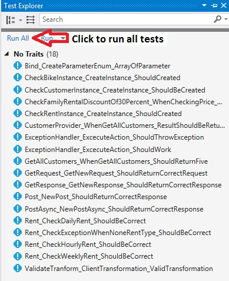

# BikeRental
Bike Rental example

## BikeRental Architecture
This repository contains the BikeRental backbone code structure.

**BikeRental projects:**
  - Intive.BikeRental.Model: Entities used in the project
  - Intive.BikeRental.Provider: Service layer to provide data from/to external services
  - Intive.BikeRental.Repository: Main access to Repositories 
  - Intive.BikeRental.Utility: Miscelaneous namespace

**CheckPrice method in Customer instance will check the final rental price, and apply the family discount if this rule apply.**

```javascript       
	public double CheckPrice()
        {
            var totalPrice = RentalsList.Sum(x => x.GetPrice());

            // 4. Family Rental, is a promotion that can include from 3 to 5 Rentals (of any type) 
            // with a discount of 30% of the total price
            if (RentalsList.Count > 2 && RentalsList.Count < 6)
            {
                totalPrice -= totalPrice * 0.3;
            }

            return totalPrice;
        }
```

## Bike Rental coverage
**Test projects:**
  - Intive.BikeRental.Model.Test
  - Intive.BikeRental.Provider.Test
  - Intive.BikeRental.Repository.Test
  - Intive.BikeRental.Utility.Test

**Run all the test from TestExplorer window:** 




**Coverage by project:**


